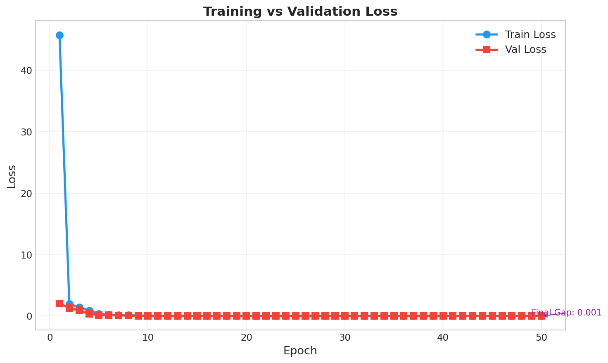
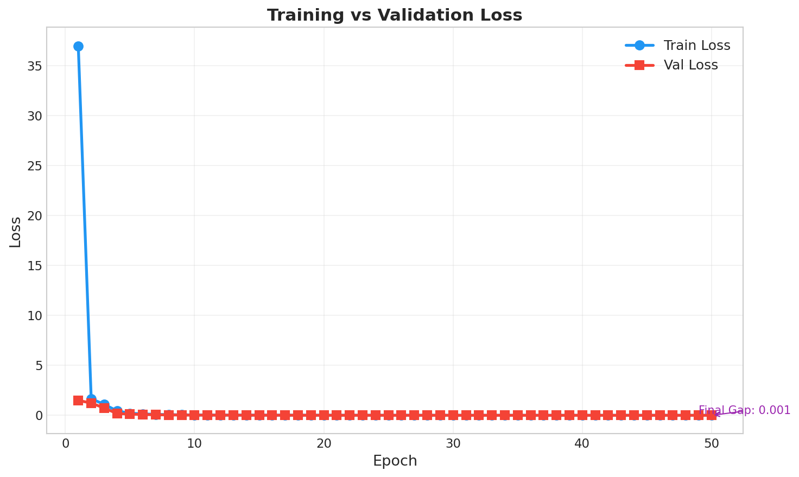
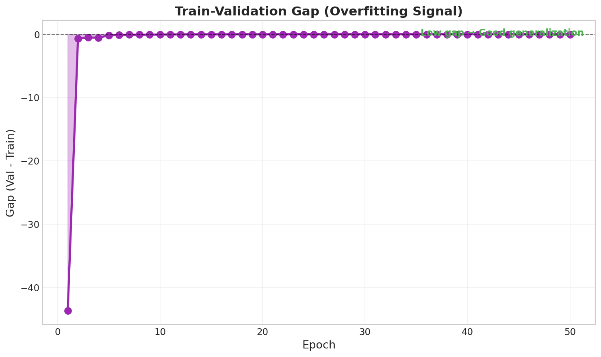
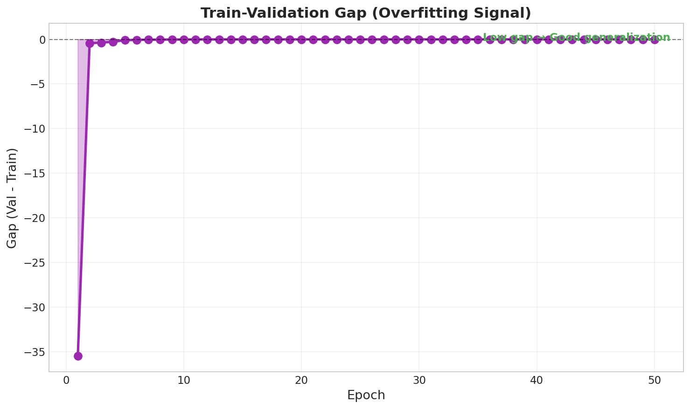
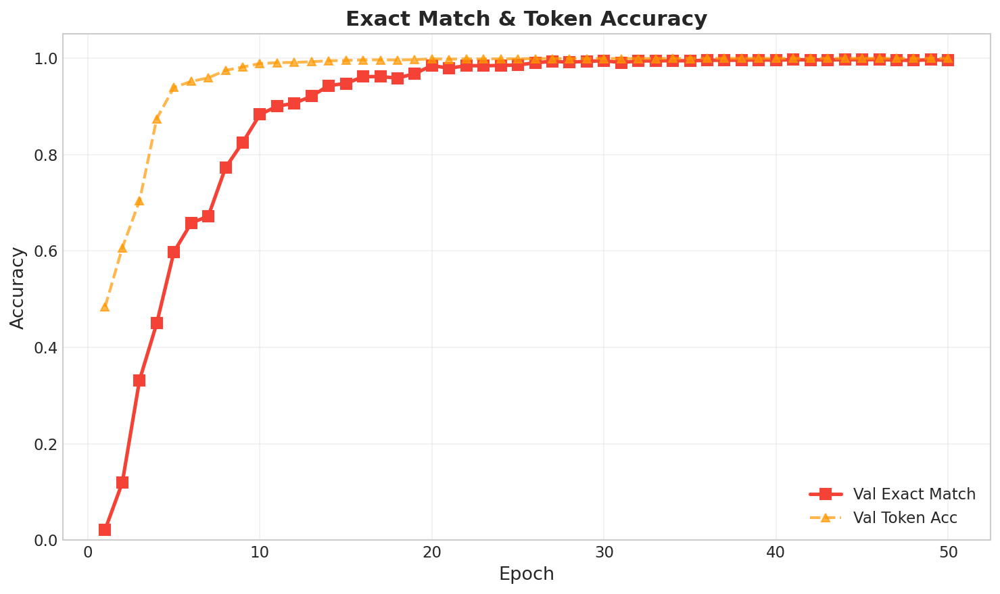
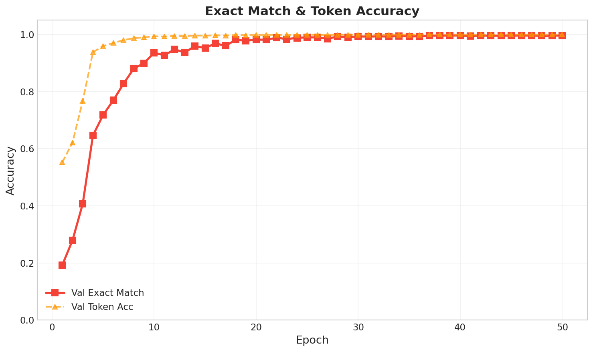
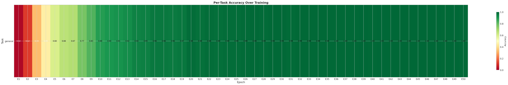
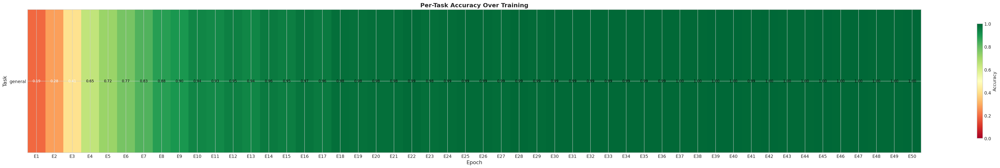
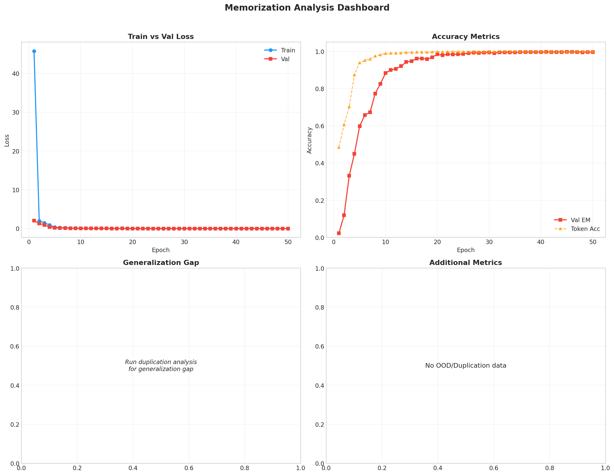
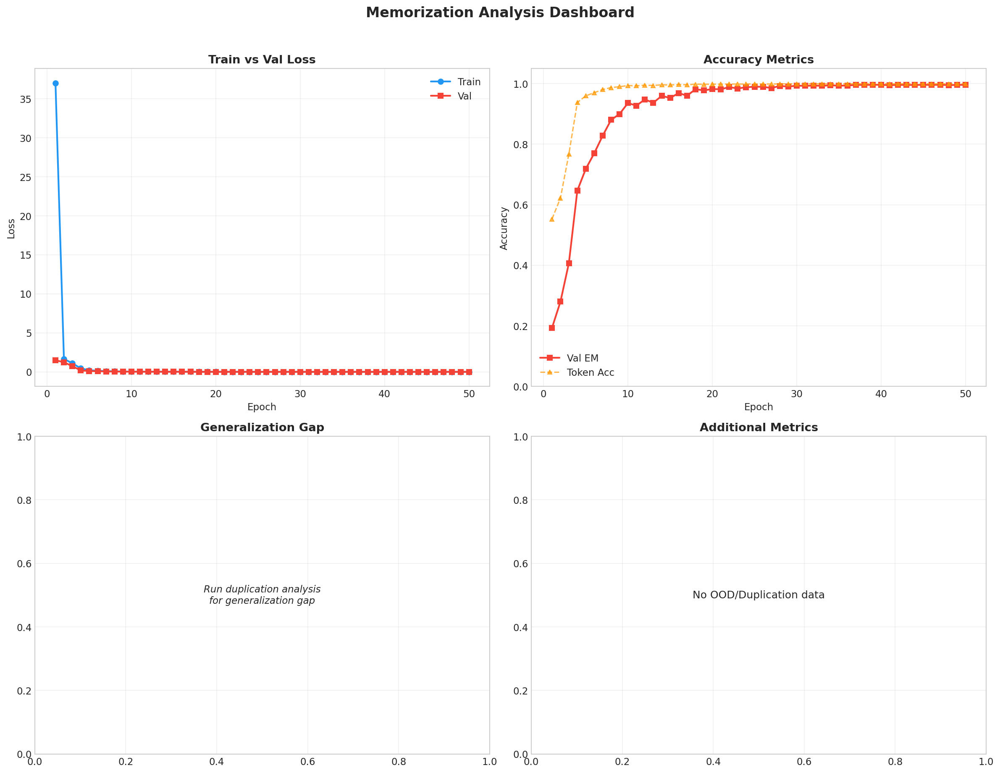

<p align="center">
  <h1 align="center">🧠 Does Data Duplication Help or Hurt Small Transformers?</h1>
  <p align="center">
    <em>An empirical study on how dataset duplication affects memorization and generalization<br>in a ~50M parameter decoder-only transformer trained on synthetic reasoning tasks.</em>
  </p>
</p>

<p align="center">
  
  
  
  
  
</p>

---

## 📌 TL;DR

> **Duplication buys speed, not capability. Deduplication buys nothing for generalization. All three models are pure memorizers.**

We trained identical small transformers on three dataset variants — deduplicated (0% duplication), normal (~27%), and intentionally duplicated (~34%) — across 5 synthetic tasks.

| # | Finding | Confidence |
|:---:|---------|:---:|
| 1 | Duplication **accelerates early training** — Normal & Dup lead Dedup by ~12pp at epoch 5 | ✅ Strong |
| 2 | All three converge to **identical final accuracy** (~99.5–99.6%) | ✅ Strong |
| 3 | **No model generalizes** OOD — 0% exact match across 7,137 test examples, all 3 conditions | ✅ Strong |
| 4 | All models **memorized input-output pairs**, not algorithms | ✅ Strong |
| 5 | Dup model shows the **best partial matching** on several OOD categories | ⚠️ Suggestive |
| 6 | Normal & Dup behave **nearly identically** across all metrics | ✅ Strong |

---

## 🔬 Research Question

**How does data duplication in training sets affect a small transformer's ability to:**
1. **Memorize** — learn exact input→output mappings from training data
2. **Generalize** — apply learned patterns to unseen inputs, tasks, and complexity levels

---

## 🏗️ Experimental Setup

### Model Architecture

All three conditions use an **identical** decoder-only transformer:

| Parameter | Value |
|:---|:---|
| Architecture | Decoder-only Transformer (GPT-style) |
| Embedding dim (`d_model`) | 512 |
| Layers (`n_layers`) | 16 |
| Attention heads (`n_heads`) | 8 |
| FFN dim (`d_ff`) | 2048 |
| Max sequence length | 128 |
| Dropout | 0.1 |
| Vocabulary | 77 tokens (character-level) |
| **Est. parameters** | **~50M** |

### Training Configuration

| Parameter | Value |
|:---|:---|
| Epochs | 50 |
| Batch size | 128 |
| Optimizer | AdamW (lr=1e-4, weight_decay=0.01) |
| LR schedule | Cosine decay → 1e-5 |
| Warmup | 1,000 steps |
| Label smoothing | 0.0 |
| Seed | 1337 |

### Synthetic Tasks

The model is trained on **5 equally-weighted synthetic reasoning tasks** (20% each):

| Task | Prefix | Example Input → Output |
|:---|:---|:---|
| **Sort** | `[sort_asc]` / `[sort_desc]` | `3 1 4 1 5` → `1 1 3 4 5` |
| **Reverse** | `[rev]` | `A B C` → `C B A` |
| **Addition** | `[add]` | `42 + 17` → `59` |
| **Copy/Repeat** | `[copy]` | `ABC repeat 3 times` → `ABCABCABC` |
| **Relations** | `[rel]` | `<E0> is parent of <E1>. Who is ancestor of <E1>?` → `<E0>` |

### Dataset Variants

The **only controlled variable** across the three conditions is the duplication rate in the training data:

| Dataset | Total Examples | Unique Examples | Duplication Rate | Description |
|:---|---:|---:|---:|:---|
| 🔵 **Deduplicated** | 51,532 | 51,532 | **0.00%** | Exact dedup — every example unique |
| 🟢 **Normal** | 64,243 | 46,684 | **27.33%** | Natural duplication from random generation |
| 🟡 **Duplicated** | 64,243 | 42,403 | **33.99%** | Top-200 examples per task repeated 10× |
| Validation (shared) | 10,000 | 7,878 | 21.22% | Same val set for all conditions |

---

## 📊 Results

### 1. Training Dynamics

#### Loss Convergence

<table>
<tr>
<td align="center"><strong>🔵 Deduplicated (0% dup)</strong></td>
<td align="center"><strong>🟢 Normal (27% dup)</strong></td>
<td align="center"><strong>🟡 Duplicated (34% dup)</strong></td>
</tr>
<tr>
<td></td>
<td></td>
<td></td>
</tr>
</table>

| Metric | 🔵 Dedup | 🟢 Normal | 🟡 Dup |
|:---|---:|---:|---:|
| Initial train loss (epoch 1) | 45.76 | 37.00 | 37.11 |
| Final train loss (epoch 50) | 0.00098 | 0.00051 | 0.00060 |
| Final val loss (epoch 50) | **0.00155** | 0.00162 | 0.00218 |
| Final train–val gap | 0.001 | 0.001 | 0.002 |

**Key observations:**
- 🟢 Normal and 🟡 Dup start with **nearly identical** initial loss (~37), while 🔵 Dedup starts **24% higher** (45.76). Repeated examples provide redundant gradient signal that makes the dataset easier to initially fit.
- At convergence, 🔵 Dedup achieves the **lowest validation loss** (0.00155), suggesting marginally less overfitting.
- 🟡 Dup shows the **largest train–val gap** (0.002 vs 0.001) — the first quantitative signal that heavier duplication increases overfitting, even if only slightly.

#### Overfitting Signal (Train–Val Gap)

<table>
<tr>
<td align="center"><strong>🔵 Deduplicated</strong></td>
<td align="center"><strong>🟢 Normal</strong></td>
<td align="center"><strong>🟡 Duplicated</strong></td>
</tr>
<tr>
<td></td>
<td></td>
<td></td>
</tr>
</table>

All three converge to a near-zero gap. The 🟡 Dup model shows a marginally wider persistent gap (0.002 vs 0.001), consistent with mild overfitting to repeatedly seen examples.

---

### 2. In-Distribution Accuracy (Memorization)

<table>
<tr>
<td align="center"><strong>🔵 Deduplicated</strong></td>
<td align="center"><strong>🟢 Normal</strong></td>
<td align="center"><strong>🟡 Duplicated</strong></td>
</tr>
<tr>
<td></td>
<td></td>
<td></td>
</tr>
</table>

| Epoch | 🔵 Dedup | 🟢 Normal | 🟡 Dup | Interpretation |
|:---:|---:|---:|---:|:---|
| 1 | 2.19% | **19.32%** | 19.57% | Normal & Dup crush Dedup early |
| 5 | 59.82% | **71.83%** | 71.26% | Dup ≈ Normal, both lead by ~12pp |
| 10 | 88.33% | **93.61%** | 91.40% | Gap narrowing |
| 20 | 97.92% | **98.16%** | 97.35% | Nearly converged |
| 30 | 99.10% | 99.28% | 99.08% | Effectively tied |
| **50** | **99.56%** | **99.65%** | **99.46%** | **All tied** (within 0.19pp) |

> #### 💡 Key Insight
> 🟢 Normal and 🟡 Dup track each other almost perfectly throughout training — they reach 19.3% and 19.6% at epoch 1, 71.8% and 71.3% at epoch 5. The additional 7 percentage points of duplication in the Dup set (34% vs 27%) provides **zero additional benefit**. Meanwhile, 🔵 Dedup starts slow (2.2% at epoch 1) but catches up by epoch 25. **Duplication has sharply diminishing returns — any amount accelerates early training, but more duplication doesn't mean faster convergence.**

#### Per-Task Accuracy Heatmaps

<table>
<tr>
<td align="center"><strong>🔵 Deduplicated</strong></td>
<td align="center"><strong>🟢 Normal</strong></td>
<td align="center"><strong>🟡 Duplicated</strong></td>
</tr>
<tr>
<td></td>
<td></td>
<td></td>
</tr>
</table>

All three models reach near-perfect accuracy (dark green) by epoch ~25. The 🔵 Dedup model's slower red→green transition (epochs 1–10) is visibly delayed compared to the other two, which transition faster and in lockstep.

---

### 3. Out-of-Distribution Generalization — The Critical Test

We evaluated all three models on **7,137 OOD examples** spanning 7 categories designed to test whether the models learned *algorithms* or merely *mappings*.

> ### 🚨 All three models achieve 0.0% exact match on ALL out-of-distribution tests.

| OOD Category | Examples | 🔵 Dedup Loss | 🟢 Normal Loss | 🟡 Dup Loss | 🔵 Partial | 🟢 Partial | 🟡 Partial |
|:---|---:|---:|---:|---:|---:|---:|---:|
| **Compositional** | 1,000 | 46.31 | 32.69 | **32.58** | 0.70% | 1.50% | **1.90%** |
| **Edge Cases** | 581 | 46.83 | 34.00 | **32.11** | **69.02%** | 55.42% | 27.88% |
| **Extrapolation** | 2,500 | 32.14 | 20.18 | **21.35** | 5.64% | 1.44% | **7.64%** |
| **Interpolation** | 999 | 43.37 | 29.54 | **30.32** | **72.57%** | 67.27% | 70.00% |
| **Novel Tasks** | 996 | 56.22 | 36.05 | **33.38** | 10.04% | 14.96% | **15.86%** |
| **Robustness** | 500 | 51.22 | 31.92 | **33.87** | 27.20% | 29.20% | **33.60%** |
| **Systematic** | 561 | 29.36 | **24.50** | 26.95 | 17.47% | 16.40% | 13.55% |
| **Overall** | **7,137** | **41.37** | **27.75** | **28.05** | — | — | — |

#### Three-Way OOD Analysis

**Loss ranking:** 🟢 Normal (27.75) ≈ 🟡 Dup (28.05) < 🔵 Dedup (41.37)

The 🟢 Normal and 🟡 Dup models produce **nearly identical overall OOD loss** (27.75 vs 28.05), while the 🔵 Dedup model's loss is ~49% higher. However, since all three score **0% exact match**, lower loss reflects better *calibration* (softer wrong predictions), not better *generalization*.

**Partial match breakdown — who gets the most tokens right?**

| Category | Best Partial Match | Runner-up |
|:---|:---|:---|
| Compositional | 🟡 Dup (1.90%) | 🟢 Normal (1.50%) |
| Edge Cases | 🔵 Dedup (**69.02%**) | 🟢 Normal (55.42%) |
| Extrapolation | 🟡 Dup (**7.64%**) | 🔵 Dedup (5.64%) |
| Interpolation | 🔵 Dedup (**72.57%**) | 🟡 Dup (70.00%) |
| Novel Tasks | 🟡 Dup (**15.86%**) | 🟢 Normal (14.96%) |
| Robustness | 🟡 Dup (**33.60%**) | 🟢 Normal (29.20%) |
| Systematic | 🔵 Dedup (**17.47%**) | 🟢 Normal (16.40%) |

No single condition consistently dominates. The 🟡 Dup model wins 4/7 categories on partial match, 🔵 Dedup wins 3/7, and 🟢 Normal wins 0/7 — but **all margins are small and none reach exact match**.

#### What the OOD Predictions Look Like

```
Task:     [sort_then_reverse] 1 5 4 1 7 7 5
Expected: 7 7 5 5 4 1 1

🔵 Dedup:  yyyyyyyyyyyyyyyyyy*yr)By < ) ) B 5 7 1 1 4 5 7
🟢 Normal: [sort<unk>then<unk>r<v<rs<]<0<011<2< < <02 1 1 1 1 4 1 5
🟡 Dup:    [sort<unk>thEn<unk>rEvErsE]<0<3111 4 1 1 7 5 7 1 1 1 1 5
```

```
Task:     [addition_extrap] 9070 + 1889
Expected: 10959

🔵 Dedup:  yaddition<unk>s<unk>etrap]188  179000 0 108
🟢 Normal: yaddition<unk>1<unk>etrap]14>  1+1666 2 288
🟡 Dup:    yaddition<unk>d<unk>etrap]16>  109088 1 1979
```

All three produce **garbled, incoherent outputs** with `<unk>` tokens when encountering unseen task tokens. The model has learned a lookup table, not a generalizable algorithm.

#### Reversal Extrapolation — The Standout Pattern

The `reversing_extrap` task (reversing longer sequences than seen in training) shows the most interesting gradient:

| Condition | Partial Match | OOD Loss |
|:---|---:|---:|
| 🔵 Dedup | 28.20% | 23.74 |
| 🟡 Dup | **38.20%** | **13.54** |
| 🟢 Normal | 7.20% | 13.93 |

The 🟡 Dup model achieves the **best partial matching on reversal extrapolation** (38.2%) with the lowest loss (13.54). This is the one OOD category where duplication appears to actually help — the model has seen the reversal pattern so many times that it can partially apply it to longer sequences.

---

### 4. Autoregressive Generation Quality

When generating outputs token-by-token (rather than teacher-forced), all three models show nearly identical behavior:

| Metric | 🔵 Dedup | 🟢 Normal | 🟡 Dup |
|:---|---:|---:|---:|
| Exact Match | 0.0% | 0.0% | 0.0% |
| Token Accuracy | 52.78% | 52.75% | 52.74% |
| Edit Distance | 0.547 | 0.547 | 0.547 |

A **47 percentage-point drop** from teacher-forced accuracy (~99.97%) to autoregressive accuracy (~52.8%) confirms all models are fragile memorizers — they cannot reliably generate correct sequences without ground-truth context at each step. Duplication level has **no measurable effect** on autoregressive generation quality.

---

### 5. Memorization Dashboard

<table>
<tr>
<td align="center"><strong>🔵 Deduplicated</strong></td>
<td align="center"><strong>🟢 Normal</strong></td>
<td align="center"><strong>🟡 Duplicated</strong></td>
</tr>
<tr>
<td></td>
<td></td>
<td></td>
</tr>
</table>

---

## ✅ Conclusions

### What We Can Confidently Say

**1. Any amount of duplication accelerates early training, but more duplication doesn't help more.**
🟢 Normal (27% dup) and 🟡 Dup (34% dup) reach nearly identical accuracy at every epoch — 19.3% vs 19.6% at epoch 1, 71.8% vs 71.3% at epoch 5. The additional 7pp of duplication provides zero additional speedup. Meanwhile, 🔵 Dedup (0% dup) starts at 2.2% and takes ~5 more epochs to catch up.

**2. All three conditions converge to identical final in-distribution performance.**
Final validation exact match: 🟢 99.65% vs 🔵 99.56% vs 🟡 99.46%. The maximum spread is only 0.19 percentage points — well within noise margin for a single-seed experiment.

**3. Dataset duplication policy has zero effect on out-of-distribution generalization.**
All three models achieve exactly **0.0% exact match** across all 7 OOD categories (7,137 examples). This is the central result: at ~50M parameters and ~50K–64K training examples, whether you deduplicate aggressively, leave natural duplicates, or intentionally oversample — **generalization does not change**.

**4. Small transformers on these tasks learn memorization, not algorithms.**
The combination of ~99.5% in-distribution accuracy and 0% OOD accuracy is the definitive signature of pure memorization. The model stores input→output pairs rather than learning the underlying sorting, addition, or reversal algorithms.

**5. 🟢 Normal and 🟡 Dup are statistically indistinguishable.**
Across training dynamics, final accuracy, OOD loss (27.75 vs 28.05), autoregressive generation (52.75% vs 52.74% token accuracy), and edit distance (0.547 vs 0.547) — the two models with duplicates behave as near-clones. Increasing duplication from 27% to 34% has **no measurable effect** on any metric.

**6. Duplication correlates with a monotonically increasing train–val gap.**
Final gap: 🔵 Dedup 0.001 → 🟢 Normal 0.001 → 🟡 Dup 0.002. While small in absolute terms, this is consistent with the expectation that repeated examples encourage overfitting to specific patterns.

### Suggestive Findings (Need More Evidence)

**7. The 🟡 Dup model shows unexpectedly strong partial matching on reversal extrapolation.**
38.2% partial match vs 28.2% (Dedup) and 7.2% (Normal). Repeated exposure to reversal patterns may reinforce a more robust structural prior for that specific operation, but this could also be noise in a single-seed experiment.

**8. 🔵 Dedup wins partial matching on edge cases and interpolation.**
69.0% on edge cases (vs 55.4% Normal, 27.9% Dup) and 72.6% on interpolation (vs 67.3% Normal, 70.0% Dup). Diverse unique examples may teach slightly different output structure priors. However, these partial matches don't translate to correct answers.

---

## ⚠️ Limitations & Caveats

| Limitation | Impact | Mitigation |
|:---|:---|:---|
| **Single seed** (1337) | No variance estimate; results could shift | Run 3–5 seeds per condition |
| **Unequal dataset sizes** | Dedup=51.5K vs Normal/Dup=64.2K | Match total training tokens instead of epochs |
| **OOD uses unseen task tokens** | Tests token novelty, not just algorithmic generalization | Use training task prefixes with harder inputs |
| **Relations task imbalance** | Dedup has only 140 unique relation examples vs ~12.8K for others | Expand relation generation space |
| **No train accuracy tracking** | Cannot directly measure memorization gap | Enable `--compute_memorization` flag |
| **Narrow dup range** (0% → 27% → 34%) | May miss non-linear effects at extreme levels | Add 5%, 10%, 50%, 80% conditions |

---

## 📂 Repository Structure

```
.
├── train_minigpt_4070.py           # Main training script (~50M param transformer)
├── evaluate_ood.py                 # Out-of-distribution evaluation suite
├── generate_synthetic_datasets.py  # Dataset generation (normal/dedup/duplicated)
├── metrics.py                      # Memorization & generalization metrics
├── plots.py                        # Visualization utilities
│
├── data/
│   └── processed/
│       ├── train_normal.pkl        # 🟢 Normal dataset (27% dup)
│       ├── train_dedup.pkl         # 🔵 Deduplicated dataset (0% dup)
│       ├── train_duplicated.pkl    # 🟡 Duplicated dataset (34% dup)
│       ├── val.pkl                 # Shared validation set
│       ├── tokenizer.json          # Character-level tokenizer
│       └── dataset_stats.json      # Dataset composition statistics
│
├── ood_data_complete/              # OOD test sets (7 categories)
│
└── runs/
    ├── normal_50M/                 # 🟢 Normal training run
    │   ├── training_history.json
    │   ├── ood_eval
    │   └── Plots/
    │
    ├── dedup_50M/                  # 🔵 Dedup training run
    │   ├── training_history (1).json
    │   ├── ood_evaluation_results.json
    │   └── plots/
    │
    └── dup_50M/                    # 🟡 Duplicated training run
        ├── training_history (2).json
        ├── ood_evaluation_results (1).json
        └── plots 2/
```

---

## 🚀 Reproduce

### 1. Generate Datasets

```bash
python generate_synthetic_datasets.py
```

### 2. Train

```bash
# 🔵 Deduplicated
python train_minigpt_4070.py \
  --data data/processed/train_dedup.pkl \
  --tokenizer data/processed/tokenizer.json \
  --out_dir runs/dedup_50M \
  --epochs 50 --lr 1e-4 --warmup_steps 1000 \
  --d_model 512 --n_layers 16 --n_heads 8 \
  --batch_size 128 --dropout 0.1 --autoreg_eval

# 🟢 Normal
python train_minigpt_4070.py \
  --data data/processed/train_normal.pkl \
  --tokenizer data/processed/tokenizer.json \
  --out_dir runs/normal_50M \
  --epochs 50 --lr 1e-4 --warmup_steps 1000 \
  --d_model 512 --n_layers 16 --n_heads 8 \
  --batch_size 128 --dropout 0.1 --autoreg_eval

# 🟡 Duplicated
python train_minigpt_4070.py \
  --data data/processed/train_duplicated.pkl \
  --tokenizer data/processed/tokenizer.json \
  --out_dir runs/dup_50M \
  --epochs 50 --lr 1e-4 --warmup_steps 1000 \
  --d_model 512 --n_layers 16 --n_heads 8 \
  --batch_size 128 --dropout 0.1 --autoreg_eval
```

### 3. Evaluate OOD

```bash
python evaluate_ood.py \
  --model runs/<run_dir>/best_model.pth \
  --tokenizer data/processed/tokenizer.json \
  --ood_dir ood_data_complete \
  --out_dir runs/<run_dir>/ood_results
```

---

## 📚 Citation

If you find this work useful, please consider citing:

```
@misc{duplication-memorization-2026,
  title   = {Does Data Duplication Help or Hurt Small Transformers?},
  year    = {2026},
  url     = {https://github.com/VivekJJadav/Temp}
}
```

---
